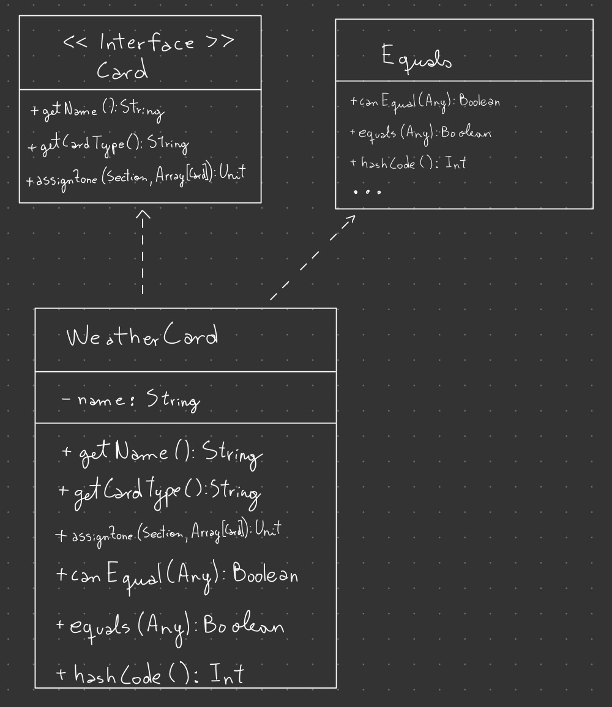
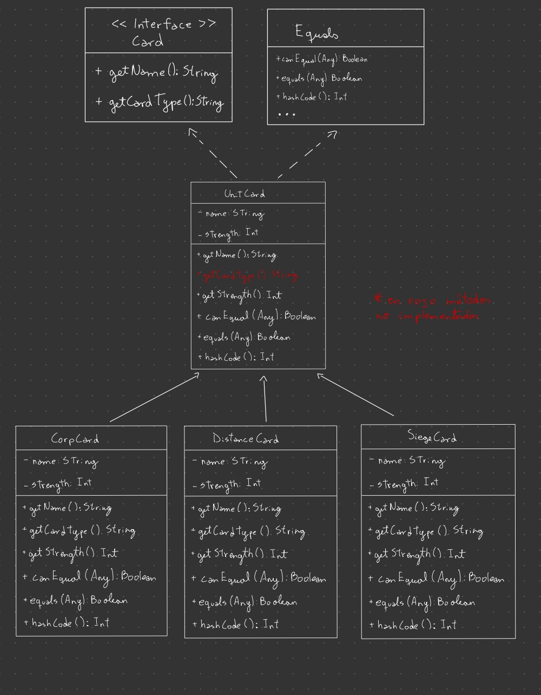
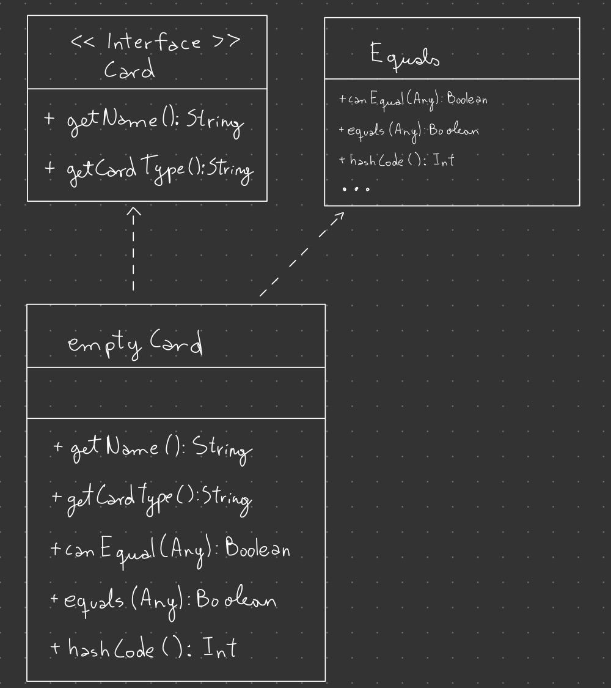
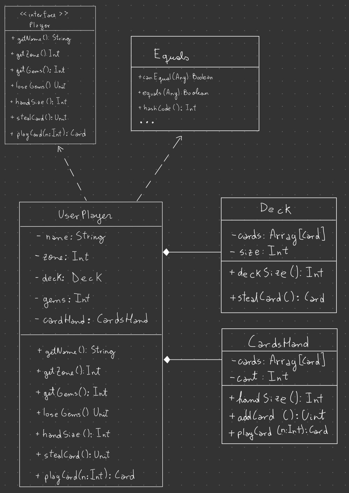

# Gwen't

This work is licensed under a
[Creative Commons Attribution 4.0 International License](http://creativecommons.org/licenses/by/4.0/)

Context
-------

This project's goal is to create a (simplified) clone of the
[_Gwent_](https://www.playgwent.com/en)card game developed by [_CD PROJEKT RED_](https://cdprojektred.com/en/)

## Cartas
Se crea un Trait Card en el cual se especifica todo lo que debe tener todas las cartas. 
Este Trait va a ser implementado  por las clases WeatherCard y UnitCard (abstract). Además, 
Se crea una carta especial (emptyCard) cuya única función es ser devuelta cuando Deck o CardsHand
están vacíos y de esta forma señalar que esta vacío.

### Interface de carta:
Todas las cartas comparten una interface (Trait "Card") en común que especifica los métodos que deben tener todas 
las cartas. Todas las cartas deben tener un nombre y un tipo (clima, cuerpo a cuerpo, a distancia o de 
asedio) por lo que deben tener un método que devuelva estos valores para poder utilizarlos, 
respectivamente estos métodos son getName y getCardType.

.jpg)

En un futuro cuando se implemente el tablero se usara getCardType para identificar a que parte de este debe ir cada carta.

### Tipos de carta:

#### WeatherCard:
Las cartas de clima son un tipo de carta especial, que se colocan en la zona de clima, 
para poder asegurar que se colocan en esa zona es que getCardType devuelve "Weather".

Estas cartas tendrán el poder de afectar el campo de batalla y brindar ventajas o desventajas a los jugadores, 
una vez que se implemeten los efectos.
Por ahora su implementación es de esta forma:

#### UnitCard:
La Clase abstracta UnitCard tiene 3 subclases, las cuales son CorpCard, SiegeCard y DistanceCard
las que respectivamente representan Unidades cuerpo a cuerpo, Unidades de asedio y Unidades a distancia.
Esta clase define los métodos getName y getStrength que devuelve el nombre y fuerza que debe tener una carta de unidad.

1. #### CorpCard: 
    Esta subclase de UnitCard representa las cartas cuerpo a cuerpo, hereda los métodos getName y getStrength
    de UnitCard y añade la implementación del método getCardType para que devuelva "CorpCard"
2. #### SiegeCard:
   Esta subclase de UnitCard representa las cartas cuerpo a cuerpo, hereda los métodos getName y getStrength
   de UnitCard y añade la implementación del método getCardType para que devuelva "SiegeCard"
3. #### DistanceCard:
   Esta subclase de UnitCard representa las cartas cuerpo a cuerpo, hereda los métodos getName y getStrength
   de UnitCard y añade la implementación del método getCardType para que devuelva "DistanceCard"

#### emptyCard:
La clase emptyCard es un tipo especial de "Carta", dado que en si no es una carta, sino que señala que no se puede 
devolver una carta. Se crea este tipo dado que tanto en Deck como en CardsHand tienen un método que 
devuelve una carta. En el caso de que no tengan una carta para entregar van a devolver este tipo especial 
para que el programa sepa que ya no quedan cartas.

---

## Jugadores
La clase UserPlayer representa a los jugadores. Esta clase implementa los métodos del Trait Player 
y hace overriding de canEqual, equals y hashcode. Los jugadores del juego van a recibir tanto la 
posición en el tablero como su mazo de cartas. 

Para representar la mano de cartas y el mazo se hace uso de las clases CardsHand y Deck. 
Con estas clases se le entrega la responsabilidad de su funcionamiento a CardsHand y Deck,
liberando de su implementación a UserPlayer
### Deck
La representación del mazo de cartas se hace con un arreglo de cartas al que no se le pueden añadir más cartas, 
solo sacar cuando el jugador quiera robar una carta. Se da por entendido ue como el jugador va a recibir 
el mazo este ya contiene las cartas que le corresponden, por lo tanto, no se le pueden añadir más.

Como hasta ahora no se ha implementado que el juego le entregue un mazo, para simular que este haya
sido barajado a la hora de robar se va a sacar una carta aleatoria del mazo. De esta forma nos aseguramos
que el juego se comporte como si se hubiese barajado el mazo.

### CardsHand
A diferencia del mazo, la mano de cartas comienza sin cartas, se le pueden ir agregando cartas cuando el jugador 
robe cartas del mazo y perderá una carta cuando el jugador juegue una carta.

---
**The rest of the documentation is left for the users of this template to complete**

